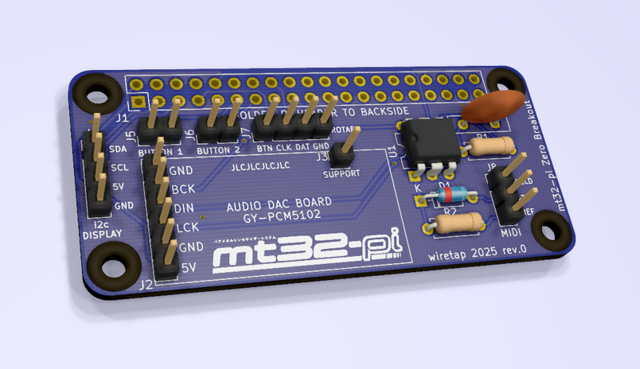

# mt32-pi Zero Breakout
A small breakout board for custom mt32-pi projects using a Raspberry Pi Zero 2 W. 
\
\

## Info
The core project design is attributed to Dale Whinham and his awesome mt32-pi project. Repo link: https://github.com/dwhinham/mt32-pi
\
\
This PCB I designed is a breakout board style header for small DIY mt32-pi projects. There are no clunky headers or connectors to take up extra space. It allows for low clearance if you direct solder as many components as you can. 
\
\
I have included the full KiCad project along with the Mouser Cart, BOM, and Gerber files for ease of upload. The design is minimalist to allow you flexibility for connectivity. I plan on using this with mostly panel-mount style connectors in my enclosure, so all I needed was solder points or 2.54mm spacing dupont connectors for everything.
\
\
Designed for use with my 5.25" bay panel found here: https://github.com/wiretap-retro/mt32-pi-bay

## Parts
The parts not listed in the BOM that you need are as follows:
- GY-PCM5102 Digital to Analog Audio Converter
- Raspberry Pi Zero 2 W
- Any other components for your specific project such as external buttons/encoders, external connectors, and i2c screens.

\
Please read the original mt32-pi repository linked in the information section for compatibility of screens, encoders, etc..

## License
This project uses the UNLICENSE. Feel free to do what you want with it. Check over the project before ordering. Build at your own risk.
